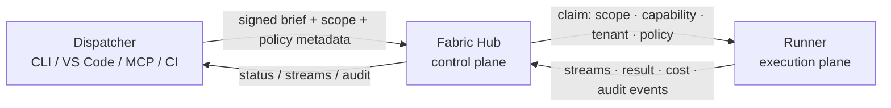

# Fabric

[](LICENSE)
[](rust-toolchain.toml)
[](#status)

> **Fabric sees the work graph.**

Send signed work to machines you trust. Let only eligible runners claim it. Enforce policy before and during execution. Preserve enough evidence to explain what happened later.

Fabric is a self-hosted execution fabric for trusted remote runners. It is the layer between your tools — CLI, VS Code, MCP, CI, automation — and the machines that do the work: GPU boxes, lab servers, build hosts, or any machine you operate. No third-party control plane. Your infrastructure, your rules, your audit trail.

**Current release: `forgewire-hub` v0.8.0 · `forgewire-runner` v0.8.0 · Python v0.17.0 · VSIX v0.4.0 · Protocol v4**

---

<!-- demo GIF goes here once recorded -->
<!--  -->

---

## Quickstart

Build the native daemons from source:

```bash
git clone https://github.com/DigitalHallucinations/forgewire-fabric.git
cd forgewire-fabric
cargo build --release
```

Generate a token and start a hub:

```bash
./target/release/forgewire-fabric-cli token gen > hub.token
export FORGEWIRE_HUB_TOKEN="$(cat hub.token)"
./target/release/forgewire-hub --host 127.0.0.1 --port 8765
```

Start a runner in another terminal:

```bash
export FORGEWIRE_HUB_URL=http://127.0.0.1:8765
export FORGEWIRE_HUB_TOKEN="$(cat hub.token)"
./target/release/forgewire-runner --workspace-root /path/to/repo
```

Dispatch work and watch it stream:

```bash
./target/release/forgewire-fabric-cli dispatch "pytest -q" --scope "tests/**"
./target/release/forgewire-fabric-cli tasks stream <task-id>
```

That's it. One hub, one runner, signed dispatch, live output. For Windows service installation, multi-machine layouts, and editor setup see [docs/QUICKSTART.md](docs/QUICKSTART.md).

> **Python CLI:** a `forgewire-fabric` Python package is available for MCP adapters, client integrations, and smoke tests. It is not the intended runtime for long-running hub or runner nodes.

---

## Why Fabric exists

Remote execution is easy to start and hard to trust.

A shared SSH key works until you need to know which task touched which path. A queue works until you need per-task approval, secrets, egress control, and replay. A scheduler works until the work is not just a container but a signed instruction with scope, capabilities, budget, and provenance. A hosted agent platform works until you realize execution policy, credentials, source access, and audit logs live in somebody else's control plane.

Fabric exists for operators who want the convenience of remote agents, build workers, GPU boxes, and private runners **without surrendering execution control**.

---

## Use cases

**AI agents on hardware you own.**
Give a coding agent or automation pipeline a Fabric dispatcher. It submits signed work briefs; runners execute in scoped workspaces; the hub enforces policy and requires human approval before pushes, merges, or egress. The agent never touches SSH keys or runner credentials.

**Private multi-machine build and test.**
Point your CI or editor at a Fabric hub. Route tests to a machine with the right workspace, GPU, or OS. Cap spending. Stream output. Inspect every result. No third-party visibility into your source or build secrets.

**LAN cluster for local AI workloads.**
Run a hub and runners on machines in your network. Zero external dependencies — mDNS discovery, rqlite-backed state, NSSM-supervised on Windows. Dispatch from VS Code or the CLI. Keep everything on-premise.

---

## Deployment profiles

| Profile | Topology | Use case |
|---|---|---|
| **Standalone** | 1 node | Laptop dev, local CI, smoke testing |
| **LAN cluster** | 2–20 nodes | Home/office fleet, zero external dependencies |

A federated overlay (Noise_IK over QUIC, capability anycast, scope-bound egress) is in active development.

---

## What it does

| Capability | Description |
|---|---|
| **Signed dispatch** | Work briefs are sealed with a signed envelope and nonce replay protection. |
| **Scope-aware routing** | Runners declare workspace prefixes; tasks outside their scope are never offered to them. |
| **Capability claims** | Tasks can require tags, tools, workspace affinity, tenant affinity, or runner capabilities before a runner may claim them. |
| **Policy gates** | Dispatch, runtime intent, and completion can be allowed, denied, or held for approval. |
| **Human-in-the-loop approvals** | Writes, pushes, merges, network egress, and shell actions can pause for operator sign-off. |
| **Cost controls** | Per-task, daily, and weekly budget limits let the hub reject work before it exceeds caps. |
| **Secret brokering** | Secrets are requested by name, injected only at claim time, and redacted from all stored output. |
| **Structured streams** | stdout, stderr, info, progress, and notes are observable while work runs. |
| **Audit chain** | Hash-chained lifecycle events and results are retained for replay and future external witnessing. |
| **Editor surfaces** | VS Code extension and MCP integration for dispatch and observation — no direct runner access required. |

---

## How it works



**Dispatcher** — any trusted client: CLI, VS Code extension, MCP tool, automation, CI. Describes what should run, where it is allowed to operate, and what capabilities or approvals it needs.

**Hub** — the control plane. Accepts dispatches, enforces policy, stores task state, tracks cost, and decides which runners may claim which work.

**Runner** — the execution plane. Registers with a stable identity, advertises capabilities, limits itself to declared scopes, executes work, streams progress, and reports results.

---

## Where Fabric fits

Fabric is not a VPN, queue, scheduler, workflow engine, or hosted agent. It sits where those systems overlap: **trusted remote work**.

| If you reach for... | It gives you... | Fabric adds... |
|---|---|---|
| **Tailscale / WireGuard** | Private reachability | Work-aware dispatch, runner identity, policy, streams, audit. |
| **NATS / RabbitMQ** | Message movement | Signed work envelopes, scoped runner claims, policy gates, result provenance. |
| **Celery / RQ / Dramatiq** | Task queues and workers | Scope/capability routing, approvals, secrets, budget, audit chain. |
| **Ray / Dask** | Distributed compute | Operator policy, trusted runners, work provenance, non-Python task semantics. |
| **Kubernetes / Nomad** | Workload scheduling | Signed intent, task-level scope, capability-aware execution, private work-control. |
| **Temporal** | Durable workflow history | Runner identity, scoped workspaces, streamed evidence, operator policy gates. |
| **Hosted coding agents** | Agent/task execution UX | Private control plane, local credentials, budget/egress/secrets policy, on-prem audit. |

> Tailscale connects machines. NATS moves messages. Kubernetes schedules workloads. Temporal records workflows. Hosted agents run tasks for you. **Fabric governs trusted work across machines you control.**

---

## Status

**Alpha — Apache-2.0.** Fabric is usable today. The Rust daemons are the primary runtime; Python is an integration surface only.

| Component | Version | Notes |
|---|---|---|
| `forgewire-hub` | 0.8.0 | axum, rqlite backend, Protocol v4 |
| `forgewire-runner` | 0.8.0 | FW_INTENT interception, bounded stream buffers |
| Python package | 0.17.0 | CLI compatibility, MCP adapters, parity bridge |
| VS Code extension | 0.4.0 | Hub badge, runner tree, approval inbox |
| Protocol | v4 | Signed-Loom-brief wire era (M2.9) |

Stable today:

- Authenticated dispatch — signed envelopes, nonce replay protection.
- Scope- and capability-aware runner claim routing.
- Runner identity persistence, trust registration, heartbeat, drain.
- Structured task streams, persisted terminal results.
- Hash-chained audit log foundation.
- Policy gates — dispatch, runtime intent, completion.
- Approval inbox with CLI workflows, ntfy.sh, Slack, and webhook notifications.
- Cost ledger — per-task, daily, and weekly budget limits with rqlite persistence.
- Secret broker — encrypted storage, name-only audit, claim-time injection, output redaction.
- Bounded stream buffers (`strict` / `balanced` / `throughput` durability profiles).
- Windows OOTB service install with NSSM supervision, watchdog, and one-command installer.
- VS Code extension — hub connection, runner/task browsing, dispatch, approvals, streams.
- Python CLI/client compatibility and MCP integration surface.

Still evolving:

- Native release bundles for Linux and macOS (Windows is the most validated path today).
- Hub HA, role-separated identity, stronger egress enforcement.
- Federated QUIC transport, capability anycast, external audit witnessing, GUI surfaces.

---

## Install

### Native Rust daemons (primary)

Build from source:

```bash
git clone https://github.com/DigitalHallucinations/forgewire-fabric.git
cd forgewire-fabric
cargo build --release
# target/release/forgewire-hub
# target/release/forgewire-runner
# target/release/forgewire-fabric-cli
```

Signed release bundles for supported platforms are the intended operator distribution path and are being hardened — see [docs/RELEASE_DISTRIBUTION.md](docs/RELEASE_DISTRIBUTION.md).

### Windows service (one-command, NSSM-supervised)

```powershell
irm https://raw.githubusercontent.com/DigitalHallucinations/forgewire-fabric/main/scripts/install/install-fabric.ps1 | iex
```

Installs rqlite, `forgewire-hub`, `forgewire-runner`, and the VS Code extension as NSSM-supervised services in a single pass. No Python required at runtime.

For manual control or production hosts, run the script directly with parameters:

```powershell
pwsh -NoProfile -ExecutionPolicy Bypass `
  -File scripts/install/install-fabric.ps1 `
  -WorkspaceRoot C:\Projects\your-repo
```

See [docs/operations/service-install.md](docs/operations/service-install.md) before running on a production host.

### Python package (MCP adapters, integrations, smoke tests)

```bash
pip install forgewire-fabric
```

Use this for MCP adapters, client integrations, and operator scripts. Not intended as a long-running hub or runner substrate.

---

## Policy and approvals

Policy is automatic. When a task is dispatched to a repository, the hub searches for a `policy.yaml` at the repo root. If none exists, a safe default is written there automatically — you get enforcement from the very first dispatch without any manual setup. Check it in, adjust it, and Fabric picks up the changes on the next dispatch.

```yaml
# auto-generated on first dispatch — edit to suit your repo
protected_branches: [main, "release/*"]
forbidden_paths: [".github/workflows/**", "secrets/**"]
max_diff_lines: 2000
require_approval: [merge, push, network_egress]
egress_allowlist: ["pypi.org", "github.com"]
daily_budget_usd: 5.00
weekly_budget_usd: 25.00
```

Three gate points enforce policy on every task:
- **Dispatch** — scope, branch, and forbidden-path checks before a task enters the queue.
- **Runtime intent** — runner calls the hub before gated actions (`fs_write`, `network_egress`, `shell_exec`, `merge`, `push`); hub returns allow, deny, or hold-for-approval.
- **Completion** — diff-line and path checks at result submission time.

Work the approval queue:

```bash
forgewire-fabric-cli approvals list
forgewire-fabric-cli approvals approve <approval-id>
forgewire-fabric-cli approvals deny <approval-id> --reason "out of scope"
forgewire-fabric-cli approvals watch   # tail mode
```

Cost controls:

```bash
forgewire-fabric-cli cost summary --since 7d --by model
forgewire-fabric-cli cost export --since 30d --format csv > spend.csv
forgewire-fabric-cli cost budget       # daily + weekly vs caps
```

See [policy.yaml](policy.yaml) for the annotated full schema.

---

## VS Code and MCP

Fabric includes editor and tool integration surfaces so operators can dispatch and observe work without giving tools direct runner access.

**VS Code extension:**

```bash
cd vscode && npm install && npm run package
code --install-extension forgewire-*.vsix
```

**MCP integration:**

```bash
forgewire-fabric mcp install --hub-url http://127.0.0.1:8765
# or with a local runner:
forgewire-fabric mcp install --hub-url http://127.0.0.1:8765 \
  --with-runner --workspace-root /path/to/repo
```

See [vscode/README.md](vscode/README.md) for extension commands and settings.

---

## Roadmap

Near-term:

- Append-only hash-chained audit export and `tasks replay <id>`.
- Structured capability tags and cheapest-fit dispatch routing.
- Egress allowlist enforcement and sealed secret broker (per-task env injection).
- Hub HA (active-passive and active-active) and role-separated identity tokens.
- Signed native release bundles for all supported platforms.
- VS Code Marketplace publish.

Longer-term:

- Federated transport over Noise/QUIC with relay fallback.
- Capability anycast URIs — `fabric://capability/<expression>`.
- Task-bound egress enforcement with userspace-first and OS-native tiers.
- External audit witnessing and signed export manifests.
- GUI/operator surfaces and Kubernetes-native deployment.

---

## Contributing

Fabric is early and rough in places. Contributions, bug reports, and feedback are welcome.

- **Bugs and feature requests** — open an issue. Include hub/runner version (`forgewire-fabric-cli --version`), OS, and the relevant log output.
- **Code contributions** — fork, branch off `main`, open a PR. For larger changes, open an issue first to discuss approach.
- **Questions** — open a discussion or issue. GitHub is the primary channel.

Before submitting:

```bash
cargo fmt --all
cargo clippy --workspace -- -D warnings
cargo test --workspace
```

---

## Repository map

| Path | Contents |
|---|---|
| `crates/` | `fabric-hub`, `fabric-runner`, `fabric-cli`, `fabric-protocol`, `fabric-policy`, `fabric-audit`, `fabric-store`, `fabric-store-rqlite`, `fabric-streams`, `fabric-beacon`, `fabric-claim-router`, `fabric-client`, `fabric-identity`, `fabric-types` |
| `python/forgewire_fabric/` | Python CLI, MCP integration, hub/runner adapters, policy helpers, cluster helpers |
| `scripts/install/` | Platform installer and service-management scripts |
| `scripts/dr/` | rqlite backup, restore, and chaos-drill scripts |
| `vscode/` | VS Code extension |
| `docs/` | Quickstart, protocol spec, release distribution, operations guides |
| `tests/` | Protocol, routing, installer, runtime parity, hub, runner, cluster, and integration tests |

---

## Documentation

- [docs/QUICKSTART.md](docs/QUICKSTART.md) — hands-on setup guide
- [docs/protocol-v3-spec.md](docs/protocol-v3-spec.md) — signed dispatch envelope details
- [docs/RELEASE_DISTRIBUTION.md](docs/RELEASE_DISTRIBUTION.md) — release artifact strategy
- [docs/operations/service-install.md](docs/operations/service-install.md) — long-running service installation
- [docs/operations/tls.md](docs/operations/tls.md) — TLS and reverse-proxy guidance
- [vscode/README.md](vscode/README.md) — editor extension guide

---

## License

Apache License 2.0 — see [LICENSE](LICENSE).
