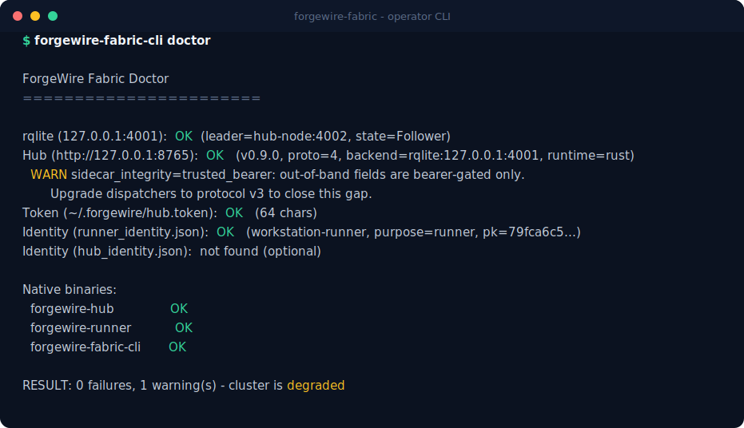
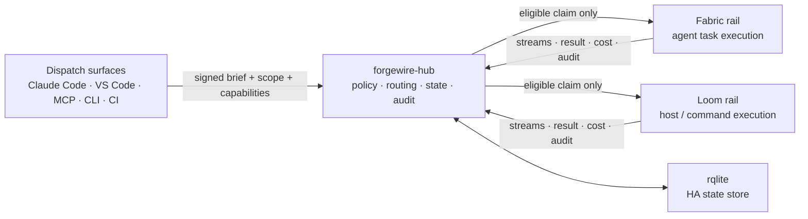

# ForgeWire Fabric

[](LICENSE)
[](rust-toolchain.toml)
[](#status)

**Dispatch work to your own machines — from your editor, your AI agent, or your CLI — with signatures, policy, and an audit trail.**

ForgeWire Fabric is a self-hosted control plane for trusted remote execution. You connect it to the tools you already drive work from — Claude Code, VS Code, MCP-capable agents, CI, scripts — and it routes that work to the machines you own: GPU boxes, build hosts, lab machines, an always-on desktop in the next room. Every task enters as a **signed envelope**, is routed **only to runners eligible for it** (scope, capabilities, kind), passes **policy gates** before and during execution, **streams every output line** live, and leaves a **hash-chained audit record** that can explain the run later.

No hosted control plane. No shared SSH key sprayed across agents. No mystery worker deciding what happened.



*`forgewire-fabric-cli doctor` against a live cluster (hostnames anonymized).*

---

## How it works



One hub, one policy layer, one audit story — and two execution rails with separate claim paths:

| Rail | What it is | Typical work |
|---|---|---|
| **Fabric** | Sending intent to a remote **agent** (Claude Code, VS Code, an orchestrator). The runner *is* the agent; it advertises its MCP tools, skills, and resources to the hub, and the hub routes by capability. | "Run the `code-review` skill on whatever agent has it," sealed coding briefs, build/test jobs with diffs and branches. |
| **Loom** | Controlling a remote **host** directly. The runner is a shell executor — no LLM in the loop. | `cargo test` on the GPU box, long-running processes with live stdin/stdout, host operations. |

A runner's rail is a property of the binary it runs, not a config flag — a Loom runner can never claim agent work, and vice versa. The hub enforces this at the claim route.

---

## Why it exists

Remote execution is easy to start and hard to trust.

A queue moves bytes, but it does not know which runner is allowed to touch `src/**`. SSH reaches a machine, but it gives no per-task provenance, approval gates, or secret redaction. A hosted agent platform gives a polished button, but it puts source access, credentials, policy, and logs in somebody else's control plane. A scheduler starts containers, but agent work is not just a container — it is an instruction with scope, capabilities, budget, approvals, and a human accountability boundary.

ForgeWire Fabric exists for operators who want remote agents and private compute **without surrendering execution control**.

---

## Quickstart

### 1. Run the daemons (one machine, ~5 minutes)

Build the workspace and generate identities:

```bash
git clone https://github.com/ForgeWireLabs/forgewire-fabric.git
cd forgewire-fabric
cargo build --release

openssl rand -hex 32 > hub.token
./target/release/forgewire-fabric-cli identity generate --purpose dispatcher --output dispatcher.identity.json
./target/release/forgewire-fabric-cli identity generate --purpose runner --output runner.identity.json
```

The hub state lives in [rqlite](https://rqlite.io) (a Raft-replicated SQLite — this is what makes hub failover possible later). Start a single dev node:

```bash
rqlited -node-id 1 ~/rqlite-data   # serves on 127.0.0.1:4001 by default
```

Start the hub in a second terminal:

```bash
export FORGEWIRE_HUB_TOKEN_FILE="$PWD/hub.token"
export FORGEWIRE_HUB_HOST=127.0.0.1
export FORGEWIRE_HUB_PORT=8765
./target/release/forgewire-hub
```

Start a runner in a third (this one executes command-kind work):

```bash
export FORGEWIRE_HUB_URL=http://127.0.0.1:8765
export FORGEWIRE_HUB_TOKEN_FILE="$PWD/hub.token"
export FORGEWIRE_RUNNER_WORKSPACE_ROOT=/path/to/repo
export FORGEWIRE_RUNNER_IDENTITY="$PWD/runner.identity.json"
export FORGEWIRE_RUNNER_SCOPE_PREFIXES="src/,tests/"
./target/release/forgewire-runner
```

Verify:

```bash
./target/release/forgewire-fabric-cli health --hub-url http://127.0.0.1:8765
./target/release/forgewire-fabric-cli doctor --hub-url http://127.0.0.1:8765
# healthz → {"status":"ok","rust_hub":true,"protocol_version":...,...}
```

(For machines that should survive reboots, skip the terminals and use the [service install](#service-install) below — it provisions rqlite and the daemons under supervision.)

### 2. Drive it from your agent

This is the part the project is actually for. Fabric ships two dispatcher MCP servers — `forgewire-loom` (host control) and `forgewire-fabric` (agent dispatch). Wire them into Claude Code or VS Code using the templates in [`install/mcp-configs/`](install/mcp-configs/README.md), or let the CLI do it for VS Code:

```bash
pip install forgewire-fabric
forgewire-fabric mcp install --hub-url http://127.0.0.1:8765
```

Then, in your agent session:

> *"List the hosts on my fabric, then run `cargo test --workspace` on the build box and show me the output."*

The agent calls `list_hosts`, then `run_command` — the hub checks policy, the Loom runner on the target machine spawns the process with a clean brokered environment, and stdout/stderr stream back into your session line by line, with the exit code and a hash-chained audit record at the end. `start_process` / `send_input` / `kill_process` cover long-running interactive work.

On the Fabric rail, agents that run the `forgewire-fabric-runner` MCP server advertise their skills and tools to the hub, and `dispatch_skill` / `dispatch_tool` route by capability: "send `code-review` to any agent that has it."

### 3. Or dispatch from the CLI

Agent briefs can also be queued from a terminal:

```bash
forgewire-fabric keys init-dispatcher --label "$(hostname)"   # one-time, ed25519
forgewire-fabric dispatch "Investigate the flaky quorum test and propose a fix" \
  --scope "tests/**" --branch agent/quorum-flake --base-commit "$(git rev-parse HEAD)"
forgewire-fabric tasks list
forgewire-fabric tasks stream 1     # live stdout/stderr/progress, line by line
```

Agent briefs are claimed by agent runners (e.g. a Claude Code session acting as a Fabric runner); host commands go through the Loom MCP tools, which sign the command, cwd, and environment into the dispatch envelope.

---

## What it does today

Every row links to the code, tests, or docs that back it.

| Capability | Evidence |
|---|---|
| **Signed dispatch** — work enters as ed25519-signed envelopes with nonce replay protection; for Loom briefs the signature covers the command, cwd, and env digest. | [protocol spec](docs/protocol-v3-spec.md) · [cross-language fixtures](tests/fixtures/phase_2_8/) |
| **Kind-split queues** — separate signed claim routes for agent and command work; the hub rejects cross-rail claims and briefs without an explicit `kind`. | [claim router](crates/fabric-claim-router/) · [routing tests](tests/hub/test_capability_routing.py) |
| **Capability-aware routing** — agent runners advertise their MCP tools/skills/resources; skill and tool dispatch route only to agents that advertise the capability. | [auth matrix](tests/fixtures/ENDPOINT_AUTH_MATRIX.md) · [mcp-configs](install/mcp-configs/README.md) |
| **Policy gates** — dispatch, runtime-intent, and completion gates can allow, deny, or hold work for human approval. | [policy.yaml.example](policy.yaml.example) · [gate tests](tests/hub/test_policy_gate.py) · [intent tests](tests/hub/test_intent_gate.py) |
| **Approvals inbox** — held work surfaces in CLI, VS Code, ntfy.sh, Slack, and webhooks for one-click approve/deny. | [approval tests](tests/hub/test_approvals.py) |
| **Secret broker** — tasks reference secrets by name; values are injected at claim time into a clean process environment and redacted from stored output. | [broker](python/forgewire_fabric/hub/secret_broker.py) · [redaction tests](tests/hub/test_secret_broker.py) |
| **Budget controls** — per-task, daily, and weekly USD caps enforced at dispatch. | [cost ledger tests](tests/hub/test_cost_ledger.py) |
| **Live streams** — stdout, stderr, progress, notes, and terminal results observable while the task runs. | [streams crate](crates/fabric-streams/) |
| **Hash-chained audit** — lifecycle events form a tamper-evident chain; `replay` reconstructs a task's sealed brief at its exact base commit. | [audit tests](tests/hub/test_audit_chain.py) · [audit crate](crates/fabric-audit/) |
| **HA state** — rqlite is the only runtime store; backups, restore drills, and chaos drills are scripted. | [DR runbook](docs/operations/dr-rqlite-backups.md) · [chaos drills](docs/operations/chaos-drills.md) |
| **LAN discovery** — UDP beacon lets runners, CLIs, and editors find the hub with zero static addressing, surviving DHCP and subnet changes. | [beacon crate](crates/fabric-beacon/) |
| **Service installs** — one-command provisioning of rqlite + hub + runner under NSSM (Windows) or systemd/launchd, with watchdogs and reboot recovery. | [service install](docs/operations/service-install.md) |

---

## Service install

<a name="service-install"></a>Windows is the most validated long-running path today. Download the installer, **read it**, then run it:

```powershell
iwr https://raw.githubusercontent.com/ForgeWireLabs/forgewire-fabric/main/scripts/install/install-fabric.ps1 -OutFile install-fabric.ps1
# inspect install-fabric.ps1, then:
pwsh -NoProfile -ExecutionPolicy Bypass -File .\install-fabric.ps1 -WorkspaceRoot C:\Projects\your-repo
```

It provisions rqlite plus the hub/runner services under NSSM supervision, including watchdog behavior for reboot and frozen-loop recovery. Joining a second machine to an existing cluster is the same command plus `-Token <cluster token>`. systemd and launchd scripts live alongside it in [`scripts/install/`](scripts/install/). Read [docs/operations/service-install.md](docs/operations/service-install.md) before installing on a production host.

---

## Policy, approvals, secrets, budget

Policy is a reviewable file, not a dashboard:

```yaml
protected_branches: [main, "release/*"]
forbidden_paths: [".github/workflows/**", "secrets/**"]
max_diff_lines: 2000
require_approval: [merge, push, network_egress]
egress_allowlist: ["pypi.org", "github.com"]
daily_budget_usd: 5.00
weekly_budget_usd: 25.00
```

It is enforced at three points:

1. **Dispatch** — branch, scope, forbidden-path, capability, and budget checks before work enters the queue.
2. **Runtime intent** — runners ask the hub before gated operations: shell execution, file writes, pushes, merges, network egress.
3. **Completion** — final diff/result checks before a terminal state is accepted.

Work that needs a human lands in the approvals inbox instead of failing; approve it from the CLI, VS Code, or a phone notification, and the dispatcher retries with the issued approval id.

Secrets follow the same rule: a task asks for a secret *name*, the hub injects the value only when an eligible runner claims, the process gets a clean environment (no inherited service env), and redaction keeps the value out of stored output and audit records.

---

## Security

The threat model is explicit: the hub is trusted; runners, dispatchers, and the network are not. Dispatch envelopes, runner claims, and Loom stdin are ed25519-signed; nonces prevent replay; the audit chain is hash-linked so tampering is detectable. The current written model lives at [docs/spec/phase-2.9/THREATMODEL.md](docs/spec/phase-2.9/THREATMODEL.md).

Two operational notes:

- The hub speaks plain HTTP by default. **Put TLS in front of any hub exposed beyond a trusted LAN** — see [docs/operations/tls.md](docs/operations/tls.md).
- The bearer token authorizes dispatch. Treat it like an SSH private key.

Found a vulnerability? Please report it privately via [GitHub Security Advisories](https://github.com/ForgeWireLabs/forgewire-fabric/security/advisories/new) rather than a public issue — see [SECURITY.md](SECURITY.md).

---

## Status

**Alpha. Rust-first. Actively hardening.** Usable today on machines you trust, not yet a polished product.

What that means concretely:

- The native Rust daemons (`forgewire-hub`, `forgewire-runner`, `forgewire-loom-runner`, `forgewire-fabric-cli`) are the deployed substrate. The Python package is the integration surface — MCP adapters, dispatch CLI, smoke tests, parity checks — not the runtime.
- The agent/command rail split recently completed its integrity hardening: signed command payloads, policy gates enforced in the native hub, clean-environment spawning, signed stdin, and full audit coverage of the command surface. Multi-host live validation of the split is the current focus.
- Windows x64 service deployment (NSSM + rqlite + watchdogs + VS Code) is the best-validated platform. Linux/macOS daemons build and run; their service paths have had less production soak.
- Protocols carry cross-language (Rust + Python) golden fixtures so the two implementations cannot silently drift.

Near-term roadmap: finish live multi-host validation of the rail split · signed release bundles and installer distribution · richer audit export, replay, and external witnessing · hub HA operations and role-separated identity. Longer-term: federated transport (Noise/QUIC with relay fallback) · capability-addressed dispatch (`fabric://capability/<expr>`) · scope-bound egress enforcement · operator GUI.

---

## Where Fabric fits

Fabric is not a VPN, message queue, scheduler, workflow engine, or hosted agent. It overlaps all of them at one boundary: **trusted remote work**.

| If you reach for… | It gives you… | Fabric adds… |
|---|---|---|
| **Tailscale / WireGuard** | Private reachability | Work-aware dispatch, runner identity, policy, streams, audit. |
| **NATS / RabbitMQ** | Message movement | Signed work envelopes, scoped runner claims, policy gates, result provenance. |
| **Celery / RQ / Dramatiq** | Task queues and workers | Scope/capability routing, approvals, secrets, budget, non-Python task semantics. |
| **Ray / Dask** | Distributed compute | Operator policy, runner trust, work provenance, human approval boundaries. |
| **Kubernetes / Nomad** | Workload scheduling | Signed intent, task-level scope, private work-control, agent/editor integration. |
| **Temporal** | Durable workflow history | Runner identity, scoped workspaces, streamed evidence, operator policy gates. |
| **Hosted coding agents** | Agent/task UX | Private control plane, local credentials, budget/egress/secrets policy, on-prem audit. |

---

## Repository map

| Path | Contents |
|---|---|
| `crates/fabric-hub` | Native hub daemon: auth, routes, policy, state, streams, audit. |
| `crates/fabric-runner` | Native runner daemon: claims command-kind work, executes as supervised subprocesses. |
| `crates/loom-runner` | Native Loom runner: host/command execution with streamed output and signed stdin. |
| `crates/fabric-cli` | Operator CLI: health, doctor, identity, audit, replay, discovery, cluster updates. |
| `crates/fabric-*` | Protocol, identity, audit, policy, store, rqlite, streams, beacon, client, claim-router, and PyO3 support crates. |
| `python/forgewire_fabric/` | Integration package: dispatcher + runner MCP servers, dispatch CLI, compatibility clients, parity tooling. |
| `install/mcp-configs/` | Ready-to-edit MCP config templates for Claude Code and VS Code. |
| `scripts/install/` | Windows, systemd, launchd, update, watchdog, and service-management scripts. |
| `scripts/dr/` | rqlite backup, restore, mirror sync, and chaos-drill tooling. |
| `vscode/` | VS Code extension: hub connection, hosts/tasks/agents trees, streams, approvals. |
| `docs/` | Quickstarts, positioning, protocol notes, threat model, operations guides. |
| `tests/` | Protocol, routing, policy, hub, runner, installer, cluster, and cross-language parity tests. |

---

## Documentation

- [docs/QUICKSTART.md](docs/QUICKSTART.md) — fuller hands-on setup path.
- [docs/POSITIONING.md](docs/POSITIONING.md) — what Fabric is and where it fits.
- [docs/operations/service-install.md](docs/operations/service-install.md) — long-running service installation.
- [docs/operations/dr-rqlite-backups.md](docs/operations/dr-rqlite-backups.md) — state backup and restore.
- [docs/operations/tls.md](docs/operations/tls.md) — TLS and reverse-proxy guidance.
- [docs/spec/phase-2.9/THREATMODEL.md](docs/spec/phase-2.9/THREATMODEL.md) — threat model.
- [install/mcp-configs/README.md](install/mcp-configs/README.md) — wiring Claude Code / VS Code via MCP.
- [vscode/README.md](vscode/README.md) — editor extension guide.

---

## Contributing

Fabric is early and rough in places. Contributions, bug reports, and operator feedback are welcome — an issue describing how a claim, gate, or stream behaved unexpectedly on your fleet is as valuable as a patch.

Before submitting code:

```bash
cargo fmt --all
cargo clippy --workspace -- -D warnings
cargo test --workspace
```

For installer changes, keep the script mirror in sync:

```bash
pwsh -NoProfile -ExecutionPolicy Bypass -File scripts/dev/sync_installer_assets.ps1
pytest tests/test_installer_assets_in_sync.py -q
```

---

## License

Apache License 2.0 — see [LICENSE](LICENSE).
